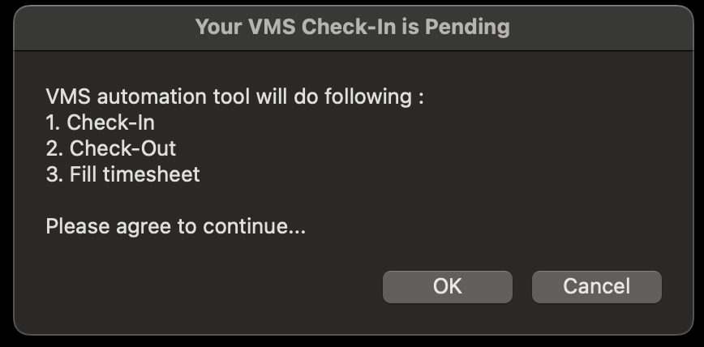
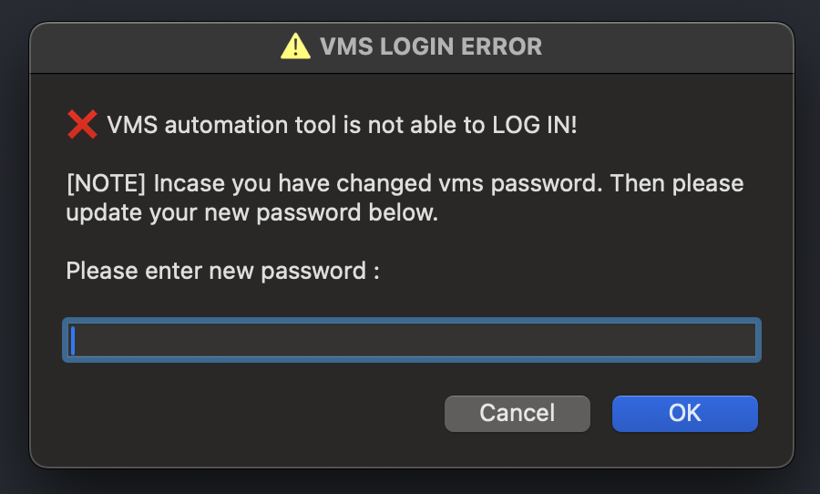

## Automated VMS check-in and check-out

This tool will schedule a cronjob on your local to do check-in, check-out and to fill the timesheet.
You can edit the cronjob based on your requirement in setup.sh file. The default cronjob will trigger from monday to friday 10:30AM to 6:30PM at every 30th minute of a hour.

### setup

__STEP 1__ :  [prerequisite] You should have node and npm installed in your machine. Check it by running following commands : 
```
node -v
nvm -v
```
NOTE : if node and nvm doesn't exists then install them from https://nodejs.org/en/download.

__STEP 2__ : Once you ensured that node and nvm exists in your machine then go into the vms directory and run the following command : 

```
./setup.sh
```

__STEP 3__ : After running the setup, update the vms credential and project code in `.env` file that exists in vms root. Just remember to update you password in future incase of password updation.

```
VMS_USERNAME=yourUsername
VMS_PASSWORD=yourPassword
```

**NOTE** : Incase you want to stop/update automated check-in, check-out then you can delete/update the cron job by executing the following command on your terminal :

```
crontab -e
```

everyday at every 20th minute you will see this popup to do the vms entries from 9AM to 6PM on Monday to Friday. You have to agree to it in order to proceed.



**WARNING** Incase your password gets changed, you will be notified and asked for updated password.

